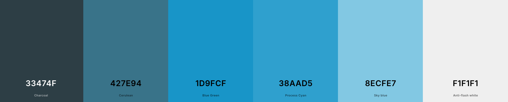
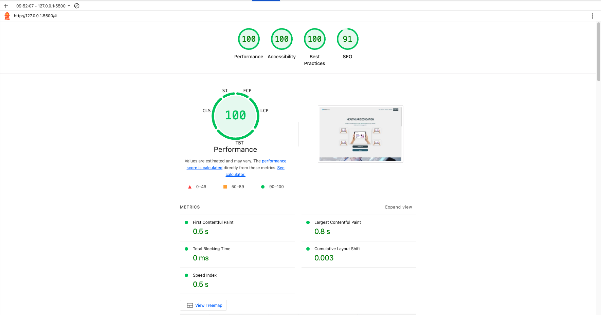

# EdutechSmart – Landningssida

## Om projektet
**EdutechSmart** strävar efter att göra digitalt lärande mer tillgängligt, inspirerande och modernt.  
Denna landningssida är ett första steg för att visa upp företagets värderingar, innovationskraft och passion för utbildningsteknik.

## Syftet med hemsidan
Landningssidans syfte är att:

- Nå ut till en bredare målgrupp genom tydlig och lättillgänglig information.
- Presentera produkten på ett användarvänligt och inspirerande sätt.
- Väcka nyfikenhet och bygga förtroende för **EdutechSmarts** vision.
- Underlätta för potentiella kunder att vidareförmedla konceptet till beslutsfattare inom utbildningssektorn.

Sidan fungerar både som en introduktion till produkten och som ett verktyg för att stärka företagets varumärke.

## Mål
- Skapa en landningssida som väcker **nyfikenhet och intresse** hos både kunder och användare.  
- Förmedla företagets **vision** på ett **inspirerande** och **tillgängligt** sätt.  
- Designa en **modern**, **mobilanpassad** och **konverteringsfokuserad** sida.

---

## Backlog & Planerade features
👉 Se [Project Board på GitHub](https://github.com/users/FiorellaDiGiulio/projects/2)

---

## 🎨 Färgpalett
-  `#33474F` – Text  
-  `#427E94`  
-  `#1D9FCF`  
-  `#38AAD5`  
-  `#8ECFE7`  
-  `#F1F1F1` – Bakgrund  

---

## Typsnitt

- **Rubriker:** [Dosis](https://fonts.google.com/specimen/Dosis)  
- **Brödtext:** [Roboto](https://fonts.google.com/specimen/Roboto)

---

## Stil & Designprinciper

- **Ren**, **modern** och **mobilanpassad** layout  
- Fokus på **Call To Action (CTA)**  
- Användning av **illustrationer** i modern, lättsam stil  
- Tydlig **typografisk hierarki**  
- Luftigt och **användarcentrerat** gränssnitt  

---

## Pitch & Prestanda

### Nya hemsidan – *Lighthouse-resultat*

### Gamla hemsidan – *Lighthouse-resultat*

